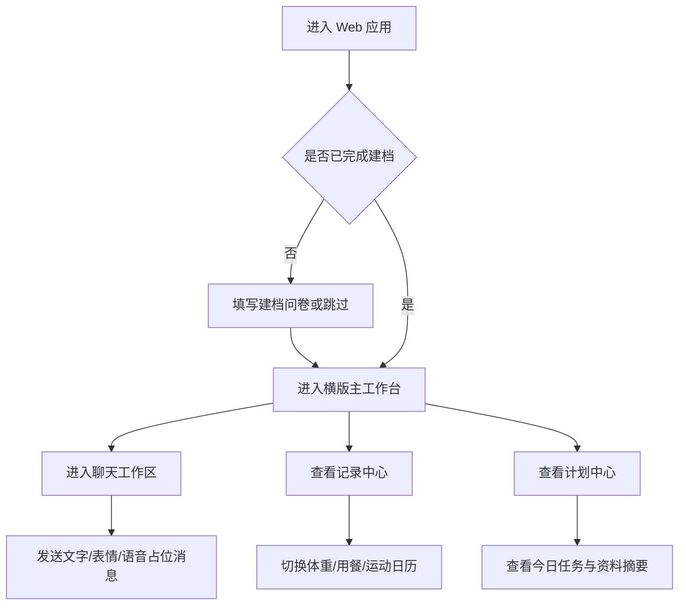

## 1. 产品概述

简贝 Web 版是将现有 iOS 减脂搭子应用改写为桌面优先、横版布局的 Web 应用，保留“陪伴式减脂”核心体验，同时强化大屏上的多栏信息协同效率。  
- 目标是把“记录、陪聊、任务、趋势”整合成一个更适合横向浏览和连续操作的工作台式产品。
- 对用户的价值不再只是“能记录”，而是让用户在一个页面内同时看到今天要做什么、最近发生了什么、搭子如何反馈。

## 2. 核心功能

### 2.1 用户角色

本期仅考虑单一角色：普通减脂用户。

| 角色 | 注册方式 | 核心权限 |
|------|----------|----------|
| 普通用户 | 暂不接真实登录，使用本地建档与本地会话 | 建档、查看主界面、聊天、查看记录、查看计划与资料 |

### 2.2 功能模块

1. **建档页**：角色选择、基础身体信息、目标与偏好录入、跳过建档
2. **横版主工作台**：顶部品牌区、左侧记录导航、中间搭子主舞台、右侧计划与摘要
3. **聊天工作区**：微信风格会话区、输入区、表情区、语音/视频通话占位
4. **记录中心**：体重/用餐/运动三类记录、日历视图、近期记录卡、快捷上传占位
5. **计划中心**：今日任务、趋势摘要、后续能力接入口、个人档案

### 2.3 页面详情

| 页面名称 | 模块名称 | 功能描述 |
|-----------|-----------|-----------|
| 建档页 | 欢迎区 | 展示产品定位、简短说明、视觉氛围与主入口 |
| 建档页 | 必填信息区 | 收集减肥搭子角色、体重、身高、性别、出生日期 |
| 建档页 | 可选信息区 | 收集职业、减脂目标、偏好 |
| 建档页 | 操作区 | 支持立即开始与稍后设置 |
| 主工作台 | 顶部导航 | 品牌、当前状态、主导航切换、快捷操作 |
| 主工作台 | 左侧记录侧栏 | 体重、用餐、运动三类入口与记录概览 |
| 主工作台 | 中央搭子舞台 | 展示搭子主视觉、状态文案、聊天/调戏/送礼物/属性入口 |
| 主工作台 | 底部反馈气泡 | 展示搭子的当前提醒文案与即时反馈 |
| 主工作台 | 右侧任务栏 | 今日任务列表、BMI、目标摘要、周趋势占位 |
| 聊天工作区 | 会话区 | 以微信风格承载聊天消息流 |
| 聊天工作区 | 输入区 | 支持文本输入、语音切换、表情、语音通话、视频通话 |
| 聊天工作区 | 表情面板 | 最近使用与全部表情两栏切换 |
| 聊天工作区 | 语音录入半屏 | 模拟按住说话、取消、转文字 |
| 记录中心 | 日历区 | 体重/用餐/运动按月高亮展示 |
| 记录中心 | 最近记录区 | 展示近几条记录及简单点评 |
| 记录中心 | 快捷上传区 | 拍照上传、相册上传、手动录入入口占位 |
| 计划中心 | 今日任务区 | 饮食、运动、情绪、打卡任务卡 |
| 计划中心 | 能力接入区 | 数字人、知识库、体脂预测等后续能力入口说明 |
| 计划中心 | 个人档案区 | 当前资料、偏好、重置建档入口 |

## 3. 核心流程

用户首次进入 Web 版时，先完成建档或选择稍后设置。完成后进入横版主工作台，默认聚焦“聊”的主场景：中间是搭子舞台，左侧是记录概览，右侧是今日计划。用户可以从主场景进入微信风格聊天，也可以切到记录中心查看体重、饮食、运动日历，或切到计划中心查看任务、趋势和个人资料。整个 V1 不接后端，全部使用本地 mock 数据与本地状态。

## 4. 用户界面设计

### 4.1 设计风格

- 主色：柔和奶油白、雾粉、豆绿色、浅雾紫
- 强调色：微信感绿色用于消息发送、确认操作与状态点亮
- 按钮风格：圆角胶囊按钮、大面积卡片、柔和阴影
- 字体风格：中文界面采用更有气质的标题字重与清晰正文层次，强调“陪伴感 + 工作台效率”
- 布局风格：桌面优先、横向多栏、中心舞台突出、左右功能协同
- 图标风格：简洁线性图标为主，局部搭配轻量拟物感

### 4.2 页面设计概览

| 页面名称 | 模块名称 | UI 元素 |
|-----------|-----------|----------|
| 建档页 | 欢迎区 | 大标题、定位标签、说明文字、柔光背景 |
| 建档页 | 表单区 | 卡片式表单、分段选择器、圆角输入框 |
| 主工作台 | 中央舞台 | 大尺寸视觉卡、渐变背景、角色圆形头像、状态信息 |
| 主工作台 | 左右侧栏 | 半透明卡片、轻阴影、纵向模块堆叠 |
| 聊天工作区 | 消息流 | 微信风格气泡、左右分布、头像、输入工具栏 |
| 记录中心 | 日历网格 | 月历高亮、记录点、标签筛选、记录明细卡 |
| 计划中心 | 任务列表 | 多类型任务卡、摘要块、资料卡、能力接入说明卡 |

### 4.3 响应式

- 明确采用桌面优先
- 目标主断点以 `1440px`、`1280px`、`1024px` 为主
- 大屏为三栏或四栏工作台
- 中屏压缩为双栏
- 小屏暂不追求完整移动端重构，但保留基础可浏览性

### 4.4 横版工作台说明

- 中央区域必须保持视觉中心地位，搭子主舞台是用户记忆点
- 左侧优先承载“记录”和“系统导航”
- 右侧优先承载“计划、摘要、资料、趋势”
- 聊天页在桌面端应支持更宽消息区与固定输入栏
- 所有信息区尽量避免全屏跳转，优先用面板切换、局部刷新、抽屉和弹层
