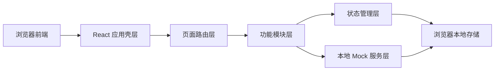
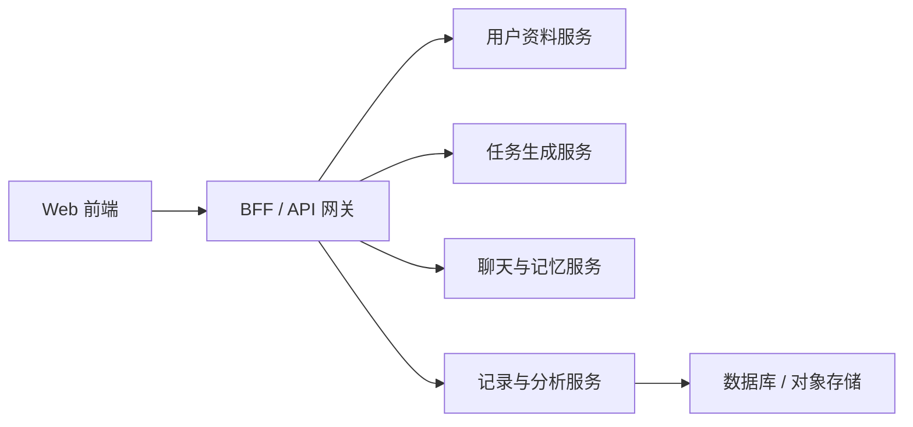
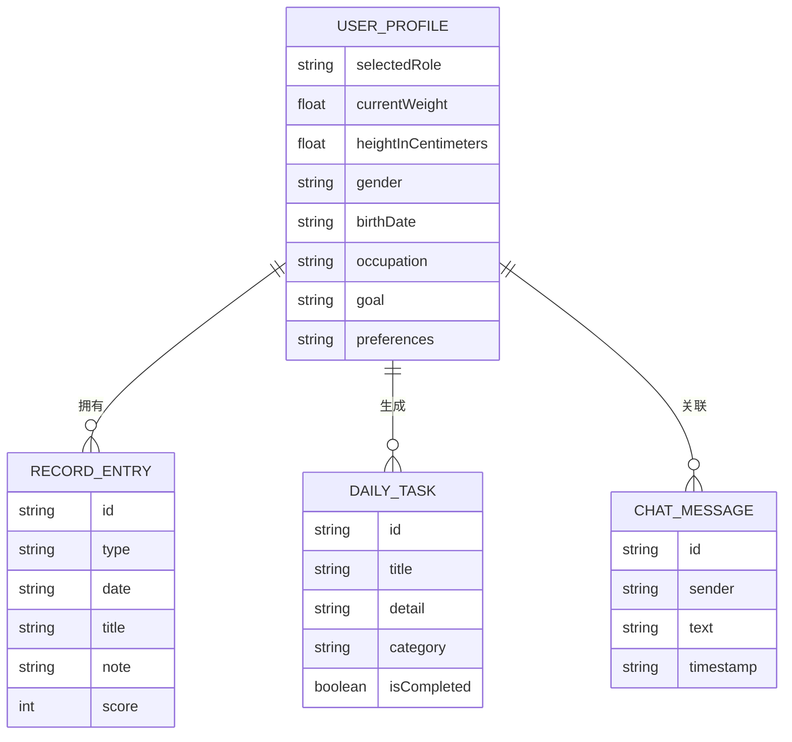

## 1. 架构设计



## 2. 技术描述

- 前端：React 18 + TypeScript + Vite + Tailwind CSS 3
- 初始化工具：Vite
- 路由：React Router
- 状态管理：React Context + hooks
- 动画：CSS 动画为主，必要时引入 Framer Motion
- 图标：Lucide React
- 数据：本地 mock 数据 + `localStorage`
- 测试：Vitest + React Testing Library

## 3. 路由定义

| 路由 | 用途 |
|------|------|
| / | 应用入口，根据建档状态进入建档页或工作台 |
| /onboarding | 建档页 |
| /workspace | 横版主工作台 |
| /chat | 聊天工作区 |
| /records | 记录中心 |
| /plans | 计划中心 |

## 4. API 定义

本期不接真实后端，仅定义前端内部数据结构与 mock 接口契约，便于后续替换。

```ts
export type CompanionRole =
  | "默认减肥搭子"
  | "温柔守护型"
  | "嘴硬心软型"
  | "自律教练型";

export type GenderOption = "女" | "男" | "非二元" | "暂不说明";

export interface UserProfile {
  selectedRole: CompanionRole;
  currentWeight: number;
  heightInCentimeters: number;
  gender: GenderOption;
  birthDate: string;
  occupation: string;
  goal: string;
  preferences: string;
}

export type RecordType = "体重" | "用餐" | "运动";

export interface RecordEntry {
  id: string;
  type: RecordType;
  date: string;
  title: string;
  note: string;
  score: number;
}

export type TaskCategory = "饮食" | "运动" | "情绪" | "打卡";

export interface DailyTask {
  id: string;
  title: string;
  detail: string;
  category: TaskCategory;
  isCompleted: boolean;
}

export interface ChatMessage {
  id: string;
  sender: "me" | "companion";
  text: string;
  timestamp: string;
}
```

## 5. 服务架构图

本期无后端服务，不建立服务端 Controller / Service / Repository 结构。  
如果后续接入后端，可扩展为：



## 6. 数据模型

### 6.1 数据模型定义



### 6.2 数据定义语言

本期不建立真实数据库，使用浏览器本地存储。建议键名如下：

```ts
const STORAGE_KEYS = {
  profile: "jianbei.web.profile",
  records: "jianbei.web.records",
  tasks: "jianbei.web.tasks",
  messages: "jianbei.web.messages",
  uiState: "jianbei.web.uiState",
};
```

## 7. 前端模块划分

| 模块 | 职责 |
|------|------|
| app | 应用入口、路由注册、全局 Provider |
| layout | 横版工作台布局、导航、主框架 |
| onboarding | 建档问卷 |
| workspace | 主舞台、侧栏、摘要卡 |
| chat | 微信风格聊天页、输入工具区、弹层 |
| records | 日历、记录列表、筛选与上传占位 |
| plans | 今日任务、趋势、资料面板 |
| services | mock 数据生成、对话响应、本地存储读写 |
| shared | 通用卡片、按钮、标签、图标封装 |

## 8. 实现约束与默认决策

- 必须保留“聊”作为最强视觉中心
- Web 版不做 iOS 式底部 Tab，改为更适合横版的顶部导航或左侧导航
- 记录、计划、聊天之间优先使用同页切换与多栏面板，而不是每次全页跳转
- 不接真实后端，先用 mock 数据闭环
- 所有数据读取必须可被未来真实 API 替换
- 桌面端为第一优先级，视觉和交互不向移动端妥协
